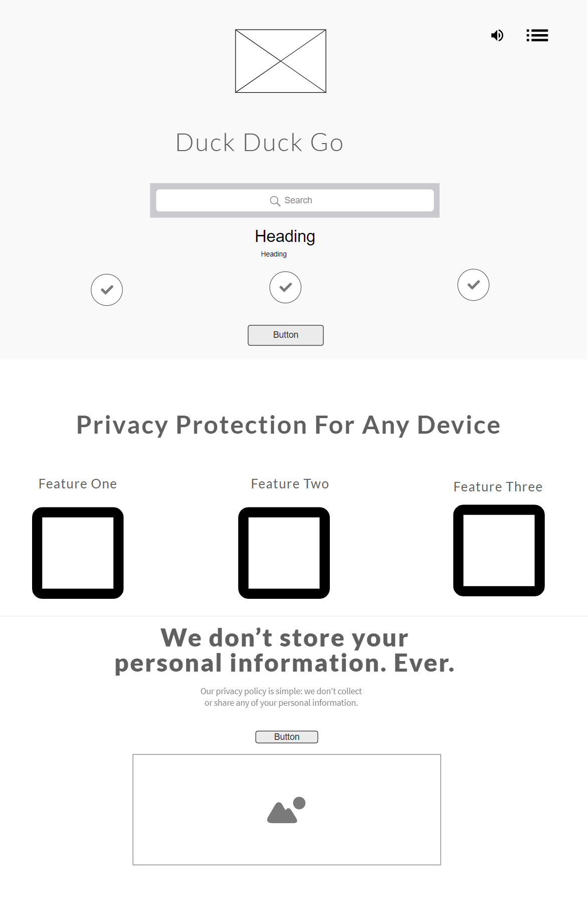

## Development Strategy

  

>  **Duck Duck Clone**

  

write a short description of your project:

- the project is a good method to learn how to collaborate, practice basic knowledge of CSS and HTML using GitHub and branching. 

  

## Wireframe

  

<!-- include a wireframe for your project in this repository, and display it here -->

<!-- wireframe.cc is a good site for getting started with wireframes -->

  

## 0. Set-Up

  *assigned to Kateryna*

  

__A User can see my initial repository and live demo__

  

### Repo

  

 - Generate repository from [w3-validation-template](https://github.com/HackYourFutureBelgium/w3-validation-template)

 - Write initial, basic README

 - Start Development Stratedy
 - Create wireframe
 - Create project board 
 - Assign issues according to agreed dev strategy
 - Turn on GitHub Pages

  

## 1. Top Section

 *assigned to Ismail*
  *reviewed by Hazem*
  

### Repository

- [ ] developed on a branch called `topsection`

### HTML

- [ ] A header element ...
- [ ] A nav element
- [ ] A right-sidebar-menu
- [ ] A drop-down menu 
- [ ] A section

### CSS

- [ ] styled elements in the HTML part

---

  

## 2. Main Section

*assigned to Hazem*
*reviewed by Kateryna*
  

__full user story description__

  

### Repo

  

- [x] developed on a branch called `box`
  

### HTML
- [x] HTML SEMANTIC
- [x] HTML LAYOUT
- [x] HTML ATTRIBUTES
- [x] HTML LINKS 
- [x] HTML IMAGE

### CSS
- [x] CSS SELECTORS 
- [x] CSS LAYOUT
- [x] CSS BOX LAYOUT
- [x] CSS SYNTAX
  

## 3. Footer
=======

*assigned to Kateryna*
*reviewed by Ismail*
  

Heading+paragraph informs User about privacy protection.

  

### Repository

- [ ] developed on a branch called `footer`

### HTML

- [x] added footer element
- [x] added header
- [x] added paragraph
- [x] added roundish border space
- [x] added button
- [x] added svg image

### CSS

- [x] styled elements in the HTML part

---
  

## Finishing Touches

  

- Write final, complete README:

-  [makeareadme.com](https://www.makeareadme.com/)

-  [bulldogjob](https://bulldogjob.com/news/449-how-to-write-a-good-readme-for-your-github-project)

-  [meakaakka](https://medium.com/@meakaakka/a-beginners-guide-to-writing-a-kickass-readme-7ac01da88ab3)

- Validate code to check for any last mistakes
